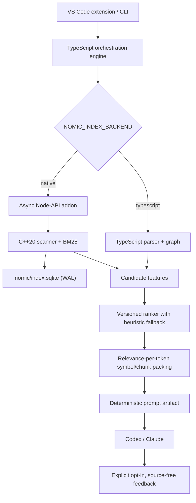

# Nomic architecture

The TypeScript parser remains the compatibility source for prompt compilation while the native backend matures. In native mode it mirrors repository indexing into SQLite and supplies BM25 candidates. The boundary is intentionally replaceable so Tree-sitter symbols and graph records can move native without changing the CLI, extension, or prompt contracts.

## Native database v1

- `metadata`: schema and feature compatibility metadata
- `files`: stable file ID, normalized path, content hash, and token count
- `terms`: document frequency
- `postings`: per-file term frequency

The database is rebuildable. Session memory, overrides, and opt-in feedback stay in their existing independent files.
